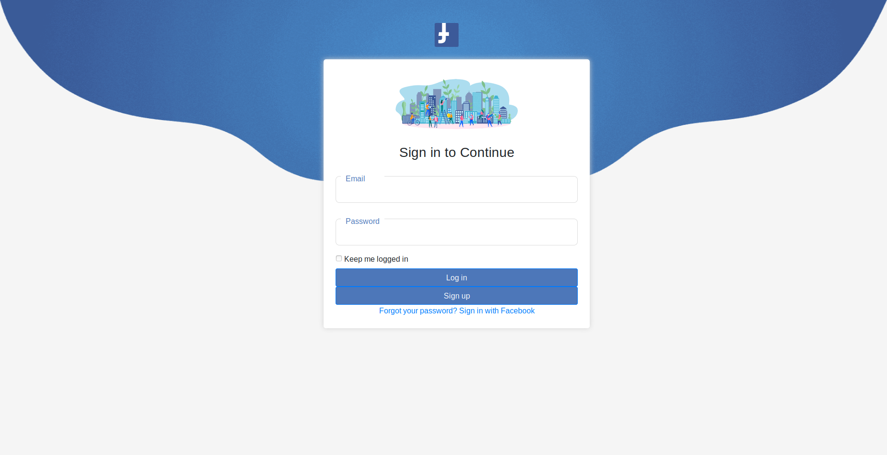

# Funbook 

> The facebook clone built in Ruby on Rails by remote pair programming.

The facebook-like application, that supports adding users, adding friends, posting liking and commenting content.



***Steps to run project in development mode***

- clone project with ```git clone```

- install necesarry gems with ``bundle``` or ```bundle install```

- run migrations with ``` rails db:migrate```

- run server with ```rails s``` or ``` rails server```


Feel free to fork, comment, suggest...

###### Authors: [Zlaya](https://github.com/zlayabekrija) and [inhaq](https://github.com/inhaq)


